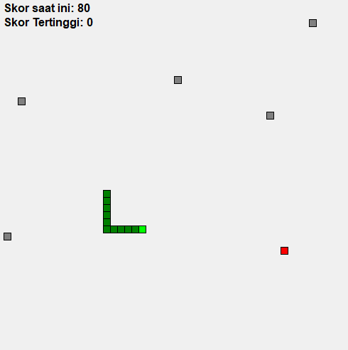

# **Game Ular**  
<p align="center">
  
</p>

## Deskripsi Aplikasi  
**Game Ular** adalah sebuah permainan klasik ular yang dibangun menggunakan Python dengan framework PyQt5. Pemain mengendalikan seekor ular yang harus mengumpulkan makanan sambil menghindari tabrakan dengan dinding atau rintangan. Skor pemain akan meningkat setiap kali ular berhasil memakan makanan, dan permainan akan berakhir jika ular menabrak dirinya sendiri atau rintangan.

## Screenshoot
<p align="center">
  
</p>

## Preinstalasi  
Pastikan Anda telah menginstal **Python** atau **Anaconda** sebelum menjalankan aplikasi ini:  
- [Download Python](https://www.python.org/downloads/)  
- [Download Anaconda](https://www.anaconda.com/products/distribution#download-section)

## Cara Instalasi  
1. Clone repository ini ke komputer Anda:
   ```bash
   git clone https://github.com/Arifmaulanaazis/Game-Ular.git
   cd Game-Ular
   ```

2. Install semua library yang diperlukan menggunakan `pip`:
   ```bash
   pip install -r requirements.txt
   ```

## Cara Menjalankan Kode  
Untuk menjalankan game, cukup jalankan script `main.py`:
```bash
python main.py
```

## Cara Berkontribusi  
Jika Anda ingin berkontribusi ke proyek ini, ikuti langkah-langkah berikut:  
1. Fork repository ini.
2. Buat branch baru untuk fitur atau perbaikan Anda (`git checkout -b feature-anda`).
3. Commit perubahan Anda (`git commit -m 'Menambahkan fitur <fitur>'`).
4. Push ke branch (`git push origin feature-anda`).
5. Buat Pull Request.

## Lisensi  
Aplikasi ini menggunakan lisensi MIT. Silakan lihat [LICENSE](LICENSE) untuk detail lebih lanjut.
